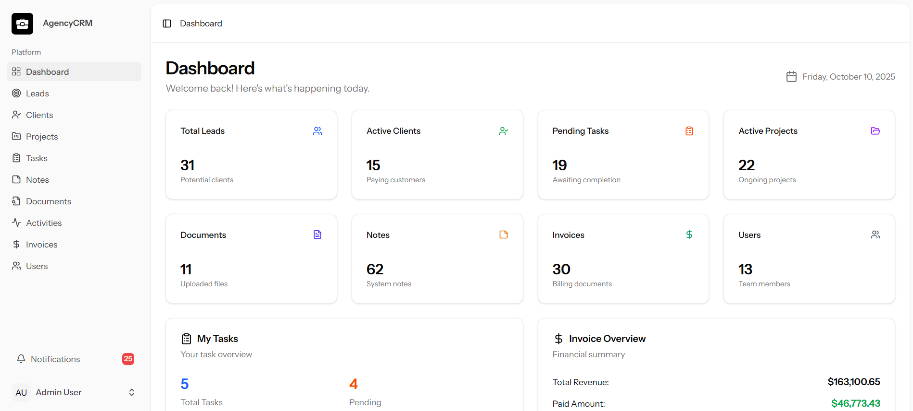

# Agency CRM

An open-source CRM solution tailored for small agencies, featuring lead/client management, task tracking, and collaborative notes. Built by [kamrankhan.dev](https://kamrankhan.dev).



## Features

### Core Modules
- **Leads Management** - Track prospects from first contact to client conversion
- **Clients** - Manage client relationships and communication history
- **Projects** - Organize client work with tasks and timelines  
- **Tasks** - Team workflow management with due dates and priorities
- **Documents** - Central repository for contracts and files
- **Invoices** - Create and track billing/collections
- **Activities** - System log of user actions and events
- **Notifications** - Real-time user alerts and reminders
- **Notes** - Collaborative documentation system  
- **Users** - Role-based access (Admin/Manager/Member)

### Database Structure
#### Entity Relationships
- Clients (1) ↔ (∞) Projects ↔ (∞) Tasks
- Users (∞) ↔ (∞) Projects via Project Members
- Leads → Clients (when converted)
- Invoices (1) ↔ (1) Clients

#### Key Tables
```
+---------------+-----------------------------+
| Table         | Key Fields                  |
+---------------+-----------------------------+
| leads         | status, source, score       |
| clients       | name, industry, revenue     |
| projects      | name, deadline, budget      |  
| tasks         | title, due_date, progress   |
| invoices      | number, amount, status      |
| documents     | name, type, version         |
| activities    | type, description, changes  |
| notifications| type, read_at, recipient_id  |
+---------------+-----------------------------+
```
### Key Functionality
- Role-based access control system
- Dashboard analytics
- CRUD operations for all core entities
- Two-factor authentication
- Responsive UI with dark/light themes

## Tech Stack

### Backend
- **Laravel 12** - PHP framework
- **MySQL** - Database
- **Inertia.js** - Server-client communication

### Frontend
- **Vue 3** - Reactive components
- **TypeScript** - Type-safe JavaScript
- **Tailwind CSS** - Utility-first styling
- **Vite** - Frontend tooling

## Installation

1. Clone repository:
```bash
git clone https://github.com/kamrankhan001/CRM-for-smalll-agency.git
cd CRM-for-smalll-agency
```

2. Install dependencies:
```bash
composer install
npm install
```

3. Configure environment:
```bash
cp .env.example .env
php artisan key:generate
```

4. Run migrations:
```bash
php artisan migrate --seed
```

5. Start development server:
```bash
npm run dev
```

## Configuration

Set these in `.env`:
```ini
APP_URL=http://localhost:8000
DB_DATABASE=crm
DB_USERNAME=root
DB_PASSWORD=
```

## User Guide

### For End Users
**Managing Clients**
1. Add new clients with contact/company details
2. Track communication history and documents
3. Convert qualified leads to clients

**Working with Projects**
- Create projects with budgets and timelines
- Assign team members and track progress
- Generate invoices from project milestones

**Invoice Workflow**  
1. Create invoices with line items
2. Send to client email directly
3. Track payment status (Paid/Unpaid/Partial)

### For Developers
**Schema Conventions**
- All tables use UUID primary keys
- Polymorphic relationships for activities/notes
- Soft deletes implemented globally
- Notification system uses Laravel Echo

## License

## Contributing
PRs welcome! Follow standard GitHub flow:
1. Fork repo
2. Create feature branch
3. Submit PR with detailed description
